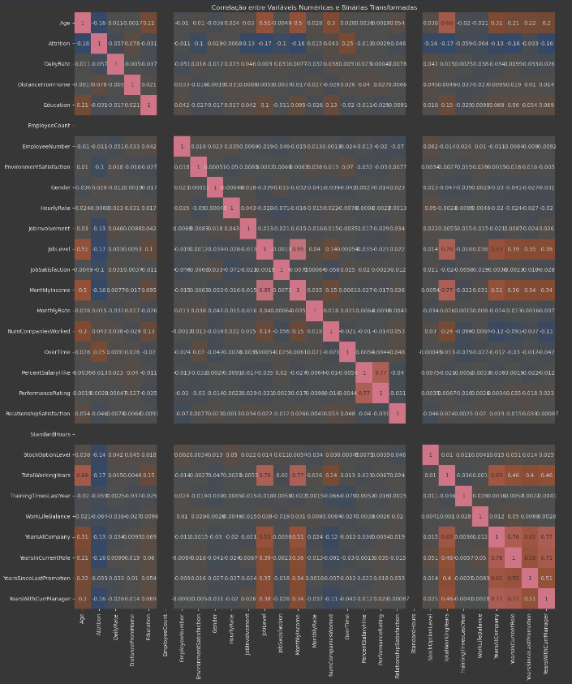

# 🚀 HR Analytics: Predição de Rotatividade de Funcionários para Retenção Estratégica

Bem-vindo ao meu projeto de Ciência de Dados, onde abordo um grande desafio em uma corporação multinacional: a rotatividade de funcionários! 🌍 Vou desenvolver um modelo preditivo que identifique quais colaboradores têm maior chance de sair da empresa, permitindo decisões estratégicas para reduzir o turnover, aumentar a retenção e melhorar a satisfação dos funcionários. Utilizando o **HR Analytics: Attrition Dataset** do Kaggle, estou explorando os dados para gerar insights e preparar o caminho para modelagem avançada. 📊

## 🌟 O Que Foi Feito (Visualização & EDA)
- **Importação de Bibliotecas e Dataset**: Carreguei ferramentas do Python (Pandas, NumPy, Seaborn, Matplotlib) e o dataset com **35 variáveis** e **1.470 registros**, explorando sua estrutura. 🛠️
- **Visualização dos Dados**: Converti variáveis categóricas como `'Attrition'`, `'OverTime'` e `'Over18'` para valores numéricos (0/1), verifiquei dados ausentes (nenhum encontrado!) e identifiquei features com distribuição desigual, como `'MonthlyIncome'` e `'TotalWorkingYears'`. 📈
- **Remoção de Features Irrelevantes**: Eliminei colunas constantes ou sem informação útil, como `'EmployeeCount'`, `'EmployeeNumber'`, `'Over18'` e `'StandardHours'`, para otimizar a análise. 🗑️
- **Análise de Padrões de Rotatividade**: Descobri que cerca de **16%** dos funcionários saíram da empresa (dataset desbalanceado). Alguns insights:
  - Quem permaneceu é, em geral, mais velho, tem salários mais altos, mora mais perto do trabalho e relata maior satisfação. 👤
  - Correlações fortes: nível de cargo com anos trabalhados, renda mensal com cargo/anos de experiência e idade com renda. 🔗
  - Funcionários solteiros, representantes de vendas, menos engajados e com menos experiência tendem a sair mais. 🚪
- **Exploração de Relações**: Visualizei gênero vs. salário mensal e outras métricas chave para entender padrões. 👩‍💼👨‍💼

---

## 📸 Alguns Gráficos!
<h3>Histograma</h3>
  
<h3>Boxplot Heatmap</h3>
  

## 🚧 O Que Vem a Seguir (Trabalho em Andamento)
Atualmente, estou focado na visualização de dados, mas os próximos passos incluem:
- **Preparar e Limpar os Dados**: Criar conjuntos de treino/teste, lidar com inconsistências e garantir que os dados estejam prontos para modelagem.
- **Construir Modelos Preditivos**: Treinar e avaliar **Regressão Logística, Random Forest e Deep Learning** para prever a rotatividade, medindo desempenho com **acurácia, precisão e recall**.
- **Gerar Insights Açionáveis**: Apresentar recomendações para o RH reduzir a rotatividade e melhorar a satisfação dos colaboradores.

---

## 🛠️ Tecnologias Utilizadas
- **Linguagens/Ferramentas**: Python, Jupyter Notebook, Pandas, NumPy, Seaborn, Matplotlib, Scikit-learn, TensorFlow (para deep learning)
- **Dataset**: [HR Analytics: Attrition Dataset](https://www.kaggle.com/pavansubhashht/hr-analytics-attrition-dataset) do Kaggle

---

## 🌈 Por Que Isso Importa para Recrutadores?
Como aspirante a estágio em Data Science, este projeto demonstra habilidades em **análise de dados, visualização e modelagem preditiva** aplicadas a um problema real de RH. Aqui, mostro minha capacidade de lidar com **datasets desbalanceados**, extrair insights e preparar dados para **Machine Learning**, sendo um candidato ideal para iniciativas orientadas por dados! 💡

---

## 🚀 Como Explorar Este Projeto
1. Clone o repositório: `git clone <seu-repo-url>`  
2. Instale as dependências: `pip install -r requirements.txt`  
3. Abra `/notebooks/EDA_HR.ipynb` no Jupyter Notebook ou VS Code para explorar as visualizações e análises.  
4. Consulte `/data/raw/Human_Resources.csv` para o dataset e `/src/` para códigos reutilizáveis (em breve!). 

## 🤝 Vamos Conectar?
Estou animado para levar minha paixão por Data Science e resolução de problemas para sua equipe! Entre em contato para conversarmos sobre como posso contribuir. 😊
